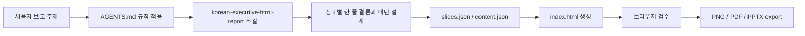

# open-design 폴더 분석 보고서

작성일: 2026-06-22  
대상 경로: `C:\Users\05507\Documents\Github\open-design`

## 1. 한 줄 결론

이 폴더는 일반 웹 애플리케이션이 아니라, 한국어 임원보고 자료를 1920x1080 HTML 덱으로 반복 생성하기 위한 전용 워크스페이스다.

## 2. 핵심 판단

| 판단 항목 | 분석 |
|---|---|
| 폴더 성격 | Codex/Open Design 기반의 한국어 보고 덱 생성 템플릿 |
| 주요 산출물 | `reports/<slug>/index.html`, `slides.json`, `content.json`, `README.md` |
| 실행 방식 | JSON 브리프를 입력하고 Node.js 스크립트로 HTML 덱을 생성 |
| 디자인 기준 | `design-systems/korean-executive-report`의 토큰과 장표 문법 |
| 현재 완성도 | 샘플 생성, 스키마 검증, 패턴 확장, PNG/PDF export까지 동작 |

## 3. 폴더 구조 요약

```text
open-design/
  AGENTS.md
  README.md
  MCP_SETUP.md
  ONE_TAKE_USE_PROMPT.md
  ONE_TAKE_CREATE_WORKSPACE_PROMPT.md
  package.json
  .agents/
  craft/
  design-systems/
  examples/
  exports/
  prompts/
  reports/
  scripts/
```

## 4. 주요 디렉터리 역할

| 경로 | 역할 | 비고 |
|---|---|---|
| `AGENTS.md` | Codex가 따라야 할 프로젝트 지침 | 보고 문법, 장표 역할, 품질 기준을 정의 |
| `.agents/skills/korean-executive-html-report/` | 보고자료 생성 스킬 | Open Design 호환 메타데이터 포함 |
| `design-systems/korean-executive-report/` | 디자인 시스템 | `DESIGN.md`, `tokens.css`, `components.html`, preview로 구성 |
| `craft/` | 보고 논리와 한글 문장 품질 규칙 | 과장 표현 방지, 의사결정 구조, 타이포 원칙 |
| `prompts/` | 생성, 수정, export, 레퍼런스 활용 프롬프트 | Codex에 그대로 붙여넣는 사용 흐름 중심 |
| `examples/` | 샘플 입력과 아웃라인 | `sample-report-brief.json`이 생성 스크립트 입력값 |
| `scripts/` | 워크스페이스 검증과 생성 도구 | `create-report.mjs`, `validate-workspace.mjs`, `export-deck.mjs` |
| `reports/` | 실제 보고 덱 산출물 | 샘플 보고서가 이미 생성되어 있음 |
| `exports/` | PNG/PDF/PPTX export 대상 | 현재는 export 결과 저장용 위치 |

## 5. 생성 파이프라인



현재 자동화는 `examples/sample-report-brief.json`에서 `reports/sample-executive-report/index.html`을 생성하고, `scripts/export-deck.mjs`로 PNG/PDF와 overflow 리포트를 만드는 단계까지 연결되어 있다.

## 6. 실행 스크립트 분석

| 명령 | 동작 | 상태 |
|---|---|---|
| `npm run validate` | 필수 파일 존재 여부 확인 | 정상 동작 확인 |
| `npm run sample` | 샘플 JSON을 HTML 보고 덱으로 변환 | 사용 가능 |
| `npm run sample:reference` | Lazyweb/Mobbin 레퍼런스 예시 덱 생성 | 사용 가능 |
| `npm run export:sample` | Playwright로 PNG/PDF export 및 overflow 점검 | 사용 가능 |
| `npm test` | 생성기, 검증기, export dry-run 회귀 테스트 | 사용 가능 |

검증 결과:

```text
npm run validate
Workspace validation passed.
```

추가 확인 결과, 현재 폴더는 Git 저장소로 초기화되어 있지 않다. 변경 이력 관리가 필요하면 `.git` 초기화 또는 상위 저장소 포함 여부 확인이 필요하다.

## 7. 강점

### 7.1 보고 문법이 명확하다

`AGENTS.md`가 Executive Summary, Situation, Issue Tree, Option Matrix, Roadmap, Risk & Control, Decision Ask 같은 장표 역할을 명확히 정의한다. 단순한 PPT 스타일링 지침이 아니라 의사결정 문법을 고정한다는 점이 강점이다.

### 7.2 출력 구조가 반복 가능하다

보고서 산출물 구조가 `reports/<slug>/` 아래의 `index.html`, `slides.json`, `content.json`, `README.md`로 고정되어 있다. HTML 결과물과 원천 JSON이 함께 남기 때문에 반복 수정에 유리하다.

### 7.3 디자인 시스템이 분리되어 있다

`DESIGN.md`는 시각 원칙을, `tokens.css`는 실제 CSS 변수를, `components.html`은 기본 컴포넌트 예시를 담당한다. 프롬프트와 구현 코드가 디자인 기준을 공유할 수 있는 구조다.

### 7.4 샘플이 실제로 동작한다

`examples/sample-report-brief.json`과 `reports/sample-executive-report/`가 연결되어 있다. 신규 사용자가 입력 형식과 결과물을 바로 비교할 수 있다.

## 8. 보완 지점

### 8.1 export 자동화는 구현됐지만 브라우저 환경 의존성이 있다

`scripts/export-deck.mjs`는 Playwright 기반 PNG/PDF export와 overflow 점검을 수행한다. 다만 Playwright Chromium 다운로드가 인증서 문제로 막히는 환경이 있을 수 있어, 스크립트는 시스템 Microsoft Edge/Chrome fallback을 사용한다.

### 8.2 슬라이드 패턴이 제한적이다

`create-report.mjs`가 처리하는 패턴은 `title`, `cards`, `split`, `matrix`, `roadmap`, `issue-tree`, `risk-control`, `appendix`까지 확장됐다. 앞으로는 KPI strip, decision ask panel 같은 세부 패턴을 추가할 수 있다.

### 8.3 스키마 검증이 없다

현재 `validate-workspace.mjs`는 필수 파일 존재 여부와 브리프 구조를 함께 확인한다. 지원하지 않는 `pattern`, 카드 개수 초과, 필수 필드 누락을 차단한다.

### 8.4 CSS 중복 가능성이 있다

`tokens.css`를 생성 HTML에 인라인 포함하고, 생성기 전용 CSS를 추가로 붙인다. 장기적으로는 컴포넌트별 CSS를 더 분리하면 관리가 쉬워진다.

### 8.5 루트 `index.html`은 제거됐다

샘플 덱은 `reports/sample-executive-report/index.html` 아래에만 둔다. 루트에는 생성 산출물을 두지 않아 워크스페이스 파일과 보고서 산출물이 섞이지 않는다.

## 9. 개선 우선순위

| 우선순위 | 개선안 | 기대 효과 |
|---|---|---|
| 완료 | Playwright 기반 export 스크립트 구현 | PNG/PDF 산출 자동화 |
| 완료 | `create-report.mjs`에 Risk & Control, Issue Tree, Appendix 패턴 추가 | 보고서 문법과 실제 렌더러 정합성 개선 |
| 완료 | `content.json`/`slides.json` 스키마 검증 추가 | 잘못된 입력을 생성 전에 차단 |
| 완료 | 루트 `index.html` 제거 및 샘플을 `reports/` 아래로 고정 | 샘플과 워크스페이스 역할 분리 |
| 완료 | `tokens.css`를 생성 HTML에 인라인 포함 | 디자인 시스템 일관성 강화 |
| P3 | 샘플 보고서 2~3개 추가 | 다양한 업무 주제에 대한 재사용성 증가 |

## 10. 권장 다음 작업

1. 실제 업무 주제 샘플을 2~3개 추가한다.
2. KPI strip, Decision Ask Panel, Process Flow 같은 세부 패턴을 추가한다.
3. 레퍼런스 MCP가 실제 도구로 노출되는 환경에서 Lazyweb/Mobbin 호출 결과를 자동으로 `references` 배열에 변환하는 어댑터를 붙인다.
4. PPTX wrapper가 필요하면 export된 PNG를 장표별로 삽입하는 별도 스크립트를 추가한다.

## 11. 최종 평가

이 폴더는 “보고자료를 예쁘게 만드는 템플릿”보다 “한국어 임원보고를 일관된 HTML 산출물로 만드는 작업 체계”에 가깝다. 핵심 지침, 디자인 시스템, 샘플 입력, 생성 스크립트가 이미 연결되어 있어 기본 사용은 가능하다.

export 자동화, 패턴 확장, 입력 검증이 보강되어 단발성 샘플 워크스페이스보다 반복 사용 가능한 보고자료 생성 도구에 가까워졌다. 다음 단계는 실제 업무 샘플과 MCP 자동 수집 어댑터를 늘리는 것이다.
